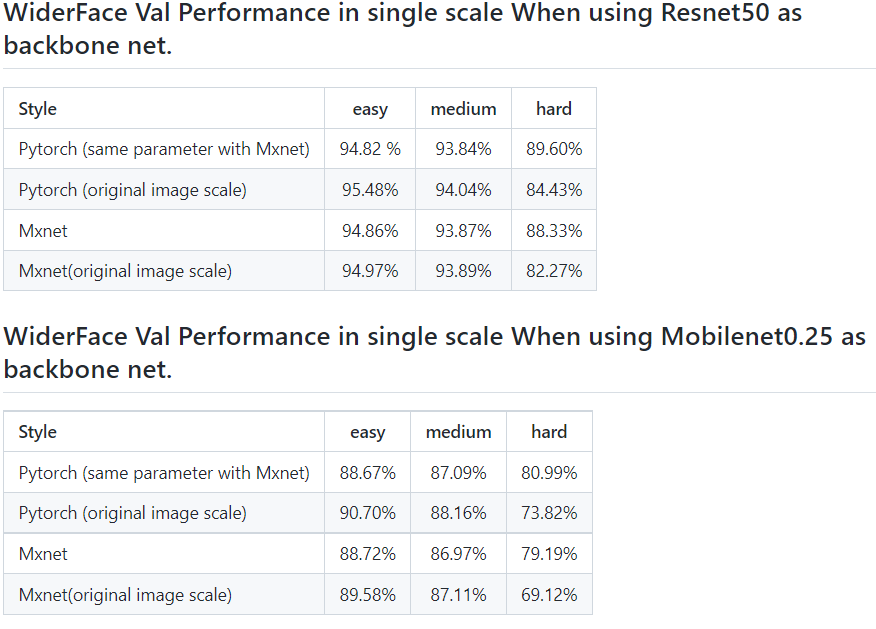

## retinaface API

## 一、接口说明

该接口为人脸检测接口

代码由官方代码重构而得，
官方代码见：https://github.com/biubug6/Pytorch_Retinaface.git

结果见下表：



## 二、环境说明

依赖见requirements.txt

## 三、参数说明

##### **retinaface.src.face_detect.face_detector**

人脸检测类

类构建参数：

1. backbone_name: str, backbone类型名，["mobile0.25", "resnet50"], 默认"mobile0.25"

2. model_weights: str, 模型权重路径，

   44服务器，路径“/home/yuyingchao/work_space/projects/huangniu_detect/Demo_code/retinaface/src/weights”中提供了"mobile0.25"模型权重，mobilenet0.25_Final.pth，

3. confidence_threshold: float, 通过该参数来ignore low scores before NMS

4. top_k: int, keep top-K before NMS
5. nms_threshold: float, NMS阈值
6. keep_top_k: int, keep top-K faster NMS
7. vis_thres: float, 最终保留人脸的阈值
8. torch.device object, 推理时的device

###### **retinaface.src.face_detect.face_detector.inference_single**

单张图片中的所有人脸检测方法

1. 输入参数：<br>
   img: ndarray, shape: (H, W, 3), 通道顺序：BGR<br>
2. 输出结果：<br>
   dets: ndarray, shape: (N, 15), (N, :4) bboxes, (N, 4) scores, (N, 5:) landmarks<br>

## 四、使用样例

在自己的项目目录下，git submodule add  https://gitlab.ictidei.cn/band-intel-center/Algorithm-platform/retinaface.git

便会在项目目录下下载到retinaface 相关代码

下载完成后，便可在自己项目中使用retinaface API，**使用样例**如下：

```python
import torch
from retinaface.src.face_detect import face_detector
device = torch.device('cuda:0' if torch.cuda.is_available() else 'cpu')
face_det = face_detector(device=device)
img_path = ""
img = cv2.imread(img_path)
dets = face_det.inference_single(img)
```

